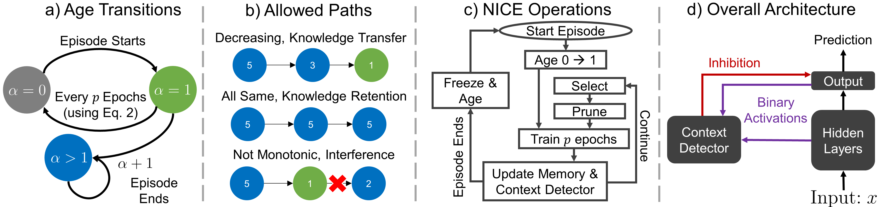

# Code will be uploaded soon.

# Neurogenesis-Inspired-Contextual-Encoding

> **Abstract:** *Deep neural networks (DNNs) struggle to learn in dynamic settings because they mainly rely on static datasets. Continual learning (CL) aims to overcome this limitation by enabling DNNs to incrementally accumulate knowledge. A widely adopted scenario in CL is class-incremental learning (CIL), where DNNs are required to sequentially learn more classes. Among the various strategies in CL, replay methods, which revisit previous classes, stand out as the only effective ones in CIL. Other strategies, such as architectural modifications to segregate information across weights and protect them from change, are ineffective in CIL. This is because they need additional information during testing to select the correct network parts to use. In this paper, we propose NICE, Neurogenesis Inspired Contextual Encoding, a replay-free architectural method inspired by adult neurogenesis in the hippocampus. NICE groups neurons in the DNN based on different maturation stages and infers which neurons to use during testing without any additional signal. Through extensive experiments across 6 datasets and 3 architectures, we show that NICE performs on par with or often outperforms replay methods. We also make the case that neurons exhibit highly distinctive activation patterns for the classes in which they specialize, enabling us to determine when they should be used.*

